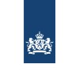

### Hi 👋
- 🔭 I'm an aspiring Artificial Intelligence MSc student ([@VU](https://vu.nl/en/education/master/artificial-intelligence)), holding a BSc in Software Engineering.
- 🌱 I am extremely driven by innovation and have worked as an external contributor on multiple innovative software projects for organizations in the Netherlands.
- ⚡ Besides innovating externally I also enjoy delving into the potential of AI and innovating within my immediate surroundings.

 

### Experience
In the overview below you will find my most recent work experience:

**AI Research Intern** \
[**Ministry of the Interior and Kingdom Relations of Netherlands (SSC-ICT)**](https://www.ssc-ict.nl/) • Intern \
Languages & Technologies: `Python`, `OpenCV`, `TensorFlow`, `Numpy` \
 

**Software Engineer Intern** \
[**Ministry of Justice and Security (SSC-I)**](https://www.justitieleictorganisatie.nl/) • Intern \
Languages & Technologies: `Vue`, `Typescript`, `SCSS`, `HTML` \
 

 

Please find me on [Linkedin](https://linkedin.com/in/cedrick-m) for a more detailed description of my full work experience, education and certification.

 

### Connect with me:

